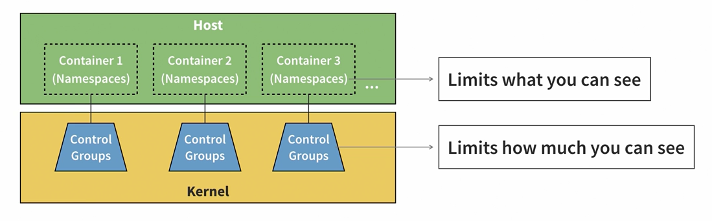

# Docker Trials

## Docker Gyan

### Containers vs Virtual Machines

| Containers                       | Virtual Machines          |
| -------------------------------- | ------------------------- |
| Run in container runtimes        | run on top of hypervisors |
| Work alongside operating systems | Need hardware emulation   |
| Do not require OS config         | require OS config         |
| Usually run one app at a time    | can run many apps at once |

### Anatomy of a Container

- 

#### Different Kernel Namespaces

| Name   | Description                |
| ------ | -------------------------- |
| USERNS | User Lists                 |
| MOUNT  | Access to file systems     |
| NET    | Network communication      |
| IPC    | Interprocess communication |
| TIME   | Ability to change time     |
| PID    | Process ID management      |
| CGROUP | Create control groups      |
| UTS    | Create host/domain names   |

- Docker containers do not support the TIME namespace.
- Docker uses Control groups for
  - Monitor and restrict CPU usage
  - Monitor and restrict network and disk bandwidth
  - Monitor and restrict memory consumption
  - Does not support Assign disk quotas

- Natively only runs on Linux, some newer versions of Windows are also supported.
- Container images are bound to their parent operating systems.

### Advantages of Docker

- Makes configuring and packaging apps and their environments easy.
- Makes sharing images very easy.
- Docker CLI makes application startup easy.

- Podman and CRI are some advantages.

## Using Docker

### Docker Best Practices

- Use verified images. They're simply more secure.
  - Can also use free image scanners like Clair, Trivy, and Dagda.
- Created proper numbered tags instead of using "latest".
- Use non-root users.

### Docker CLI

```sh
# Docker CLI help
docker --help
docker pull --help

# Creating a container
docker container create hello-world:linux

# list containers
# Only shows running containers
docker ps
# Shows all containers
docker ps -a

# start container
docker container start <first-x-chars-of-container-id>

# see logs
docker logs <first-x-chars-of-container-id>

# attach the container to the application
docker container start <first-x-chars-of-container-id> --attach

# docker run = container create, container start, container attach.
docker run hello-world:linux

# builds an image from a docker file
docker build -t my-first-image .
docker build -f server.Dockerfile . --tag first-server

# -d to not attach the terminal to the application
docker run -d first-server

# execute commands in the container
docker run -d first-server
docker exec --interactive --tty db0 bash

# stop applications
docker stop db0
# Force stop
docker stop -t 0 db0

# remove containers
docker rm af6
# remove containers that are running i.e. stop and delete
docker rm -f
# remove all containers
docker ps -aq | xargs docker rm

# list images
docker images
# remove images
docker rmi first-server abcd askjgdakshd

# run with name
docker run -d --name web-server web-server
docker logs web-server

# run with port mapping
docker run -d --name web-server -p 5001:5000 web-server

# login to docker
docker login
# rename an image
docker tag web-server anshul98/web-server:0.0.1

# clean up a bunch of space in the docker VM
docker system  prune

# container performance snapshot
docker stats
# runs the container to sleep infinitely
docker run --name alpine --entrypoint=sleep -d alpine infinity
# runs an interactive tty shell on the container
docker exec -i -t alpine sh

# shows what's happening in a container
docker top alpine
# shows a bunch of details about the container
docker inspect alpine

# last exercise
docker build . --tag xen
docker stats xen # to check the usage
docker top xen # to look for culprits killing the container
docker run -it --name xen xen # for an interactive shell
```

### Docker File

- FROM: the base image. Docker will pull it from docker hub if it's not already there locally.
- LABEL: various tagging properties.
- USER: the user to use for commands execution
- COPY: copies stuff from a local directory to the image. The directory provided to docker is called the context and is the execution dir by default, but it can be changed.
- RUN: commands to customize the image.
- ENTRYPOINT: defines the entry point of the docker image.
- CMD: defines the default args for ENTRYPOINT.

### Saving Data from Containers

```sh
# create a file in the container via shell and save it into the machine using volume mounting
docker run --rm --entrypoint sh -v /tmp/container:/tmp ubuntu -c "echo 'hello there.' > /tmp/file && cat /tmp/file"

# running an nginx server
docker run --name website -p 8080:80 -v "$PWD/website:/usr/share/nginx/html" --rm nginx
```
